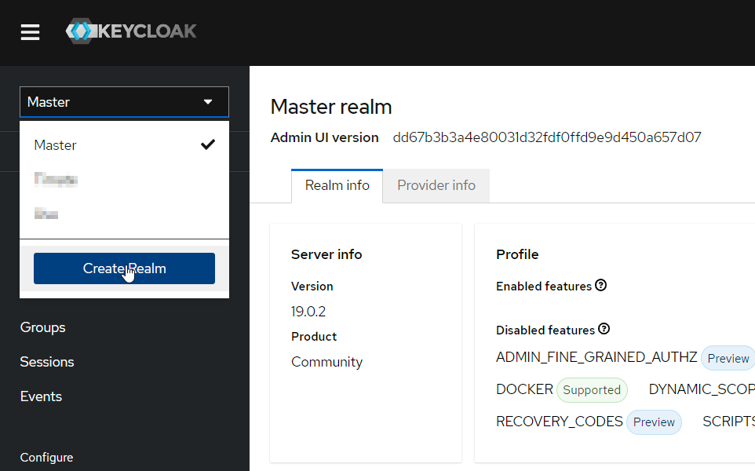
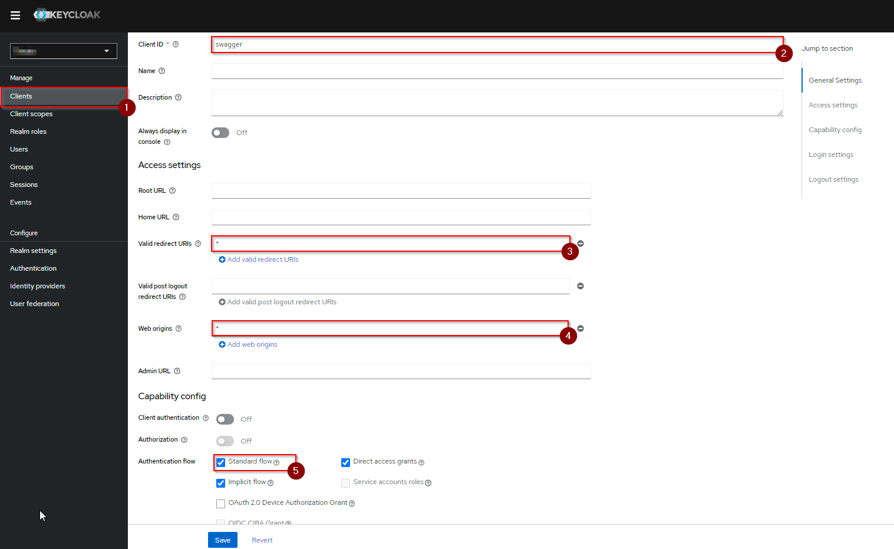
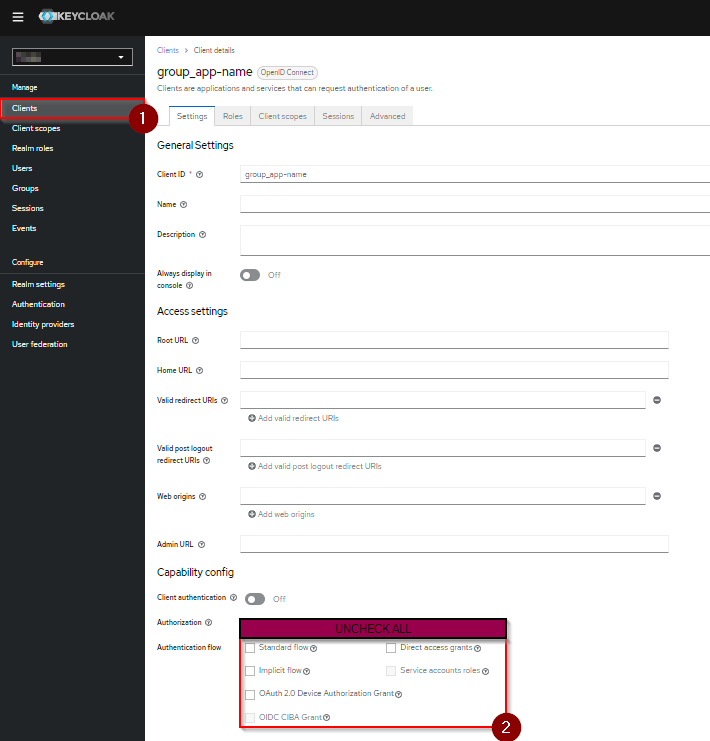
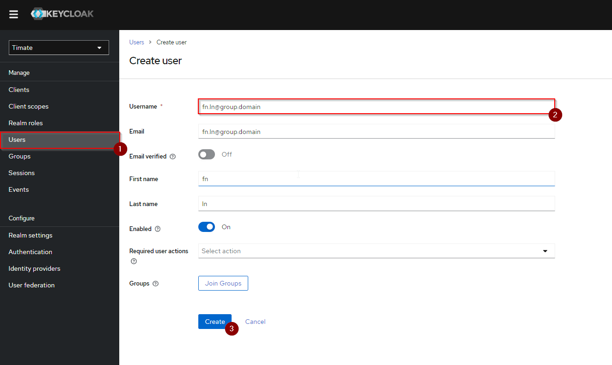

# Spring Boot Template Project

## Versions
| Name     | Version |
| -------- | ------- |
| Gradle   | `7.5`   |
| Java     | `17`    |
| Keycloak | `19`    |


## Features

- :heavy_check_mark: Keycloak Authentication
- :heavy_check_mark: Swagger + Swagger Authentication via Keycloak (implicit & client-credentials)
- :heavy_check_mark: Caching using Redis + clear cache endpoint
- :heavy_check_mark: Startup Logger + Logger bean injection
- :heavy_check_mark: Object Mapping (json-nullable, kotlin specifics)
- :heavy_check_mark: Dynamic Security Configuration
- :heavy_check_mark: Index Page
- :heavy_check_mark: API Versioning
- :heavy_check_mark: Dummy implementation (controller, service, entity, repository & dto)
- :heavy_check_mark: API Json response formatting
- :heavy_check_mark: Maria DB + Liquibase
- :heavy_check_mark: Dockerfile + GitHub Action

## Start

**Prerequisites:**
- Docker Desktop & Logged into Docker
- Some IDE
- Tool to execute bash script (on Windows may use GitBash)

<br/>

To set up project run ``./replace-names.sh``
````shell
./setup-project.sh -d "<domain>" -g "<group>" -a "<app-name>"
````

*After script finished....*

 1. Navigate to [Keycloak Admin Console](http://host.docker.internal:3000/admin/) (pw: admin; un: admin)
 2. Create realm ``<group>`` (see image 1)
 3. Create client ``swagger`` in created realm (see image 2)
 4. Create client ``<group>_<app-name>`` in created realm (see image 3)
 5. Create user in created realm (see image 4 + 5)
 6. Run application & open [index page](http://localhost:8080/)
 7. Follow link to Swagger, then hit authenticate and use ``implicit authentication flow`` & finally login with the user you created
 8. :tada: Be able to fetch ``dummy-objects`` via Swagger

<br/>

Image 1: <br/>


Image 2: <br/>


Image 3: <br/>


Image 4: <br/>


Image 5: <br/>

