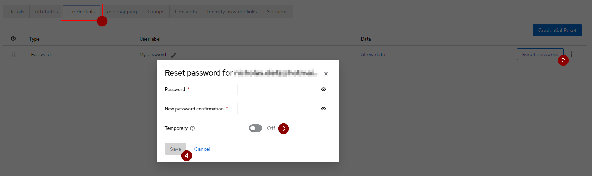

# Spring Boot Template Project
*Clone repository, execute script & start writing code without the same boilerplate over and over again.*

<br/>

## About
**Versions:** `Gradle 7.5` `Java 17` `Keycloak 19.0.2`

**Features:** <br/>
:heavy_check_mark: Keycloak Authentication <br/>
:heavy_check_mark: Swagger + Authentication via Keycloak <br/>
:heavy_check_mark: Caching using Redis + clear cache endpoint <br/>
:heavy_check_mark: Startup Logger + Logger bean injection <br/>
:heavy_check_mark: Object Mapping <br/>
:heavy_check_mark: Index Page <br/>
:heavy_check_mark: API Versioning <br/>
:heavy_check_mark: Dummy implementation (controller, service, entity, repository & dto) <br/>
:heavy_check_mark: API Json response formatting <br/>
:heavy_check_mark: Maria DB + Liquibase <br/>
:heavy_check_mark: Dockerfile + GitHub Action <br/>

<br/>

## Prerequisites
- Docker Desktop & Logged into Docker
- Some IDE
- Tool to execute bash script (on Windows may use GitBash)

<br/>

## Start

````shell
# Run the script
./setup-project.sh -d "<domain>" -g "<group>" -a "<app-name>"
````

*After script finished....*

 1. Navigate to [Keycloak Admin Console](http://host.docker.internal:3000/admin/) (pw: admin; un: admin)
 2. Create realm ``<group>`` (see image 1)
 3. Create client ``swagger`` in created realm (see image 2)
 4. Create client ``<group>_<app-name>`` in created realm (see image 3)
 5. Create user in created realm (see image 4 + 5)
 6. Run application & open [index page](http://localhost:8080/)
 7. Follow link to Swagger, then hit authenticate and use ``implicit`` & finally login with the user you created
 8. Finally fetch objects via ``GET api/v1/dummy-objects`` in Swagger :tada:

<br/>


<br/> *Image 1* <br/><br/>


<br/> *Image 2* <br/><br/>


<br/> *Image 3* <br/><br/>


<br/> *Image 4* <br/><br/>


<br/> *Image 5* <br/><br/>


Sample log of application start:
```text
  .   ____          _            __ _ _
 /\\ / ___'_ __ _ _(_)_ __  __ _ \ \ \ \
( ( )\___ | '_ | '_| | '_ \/ _` | \ \ \ \
 \\/  ___)| |_)| | | | | || (_| |  ) ) ) )
  '  |____| .__|_| |_|_| |_\__, | / / / /
 =========|_|==============|___/=/_/_/_/
 :: Spring Boot ::                (v2.7.4)

2022-10-15 22:55:45.857  INFO 7344 --- [           main] c.t.c.CoreserviceApplicationKt           : Starting CoreserviceApplicationKt using Java 17.0.4 on XXXX with PID 7344 (D:\spring-boot-template-project\build\classes\kotlin\main started by XXXX in D:\spring-boot-template-project)
2022-10-15 22:55:45.860  INFO 7344 --- [           main] c.t.c.CoreserviceApplicationKt           : No active profile set, falling back to 1 default profile: "default"
2022-10-15 22:55:45.919  INFO 7344 --- [           main] c.t.c.config.log.StartupLogger           : Properties (..)
2022-10-15 22:55:46.986  INFO 7344 --- [           main] .s.d.r.c.RepositoryConfigurationDelegate : Multiple Spring Data modules found, entering strict repository configuration mode
2022-10-15 22:55:46.986  INFO 7344 --- [           main] .s.d.r.c.RepositoryConfigurationDelegate : Bootstrapping Spring Data JDBC repositories in DEFAULT mode.
2022-10-15 22:55:47.011  INFO 7344 --- [           main] .RepositoryConfigurationExtensionSupport : Spring Data JDBC - Could not safely identify store assignment for repository candidate interface com.timate.coreservice.model.db.repository.DummyRepository; If you want this repository to be a JDBC repository, consider annotating your entities with one of these annotations: org.springframework.data.relational.core.mapping.Table.
2022-10-15 22:55:47.011  INFO 7344 --- [           main] .s.d.r.c.RepositoryConfigurationDelegate : Finished Spring Data repository scanning in 22 ms. Found 0 JDBC repository interfaces.
2022-10-15 22:55:47.021  INFO 7344 --- [           main] .s.d.r.c.RepositoryConfigurationDelegate : Multiple Spring Data modules found, entering strict repository configuration mode
2022-10-15 22:55:47.021  INFO 7344 --- [           main] .s.d.r.c.RepositoryConfigurationDelegate : Bootstrapping Spring Data JPA repositories in DEFAULT mode.
2022-10-15 22:55:47.063  INFO 7344 --- [           main] .s.d.r.c.RepositoryConfigurationDelegate : Finished Spring Data repository scanning in 38 ms. Found 1 JPA repository interfaces.
2022-10-15 22:55:47.518  INFO 7344 --- [           main] o.s.b.w.embedded.tomcat.TomcatWebServer  : Tomcat initialized with port(s): 8085 (http)
2022-10-15 22:55:47.525  INFO 7344 --- [           main] o.apache.catalina.core.StandardService   : Starting service [Tomcat]
2022-10-15 22:55:47.525  INFO 7344 --- [           main] org.apache.catalina.core.StandardEngine  : Starting Servlet engine: [Apache Tomcat/9.0.65]
2022-10-15 22:55:47.645  INFO 7344 --- [           main] o.a.c.c.C.[Tomcat].[localhost].[/]       : Initializing Spring embedded WebApplicationContext
2022-10-15 22:55:47.646  INFO 7344 --- [           main] w.s.c.ServletWebServerApplicationContext : Root WebApplicationContext: initialization completed in 1725 ms
2022-10-15 22:55:48.114  INFO 7344 --- [           main] liquibase.lockservice                    : Successfully acquired change log lock
2022-10-15 22:55:48.133  INFO 7344 --- [           main] liquibase.changelog                      : Reading resource: db/changelog/changes/v0.0.1-1.xml
2022-10-15 22:55:48.308  INFO 7344 --- [           main] liquibase.changelog                      : Reading resource: db/changelog/changes/v0.0.1-2.sql
2022-10-15 22:55:48.401  INFO 7344 --- [           main] liquibase.changelog                      : Reading from timate.DATABASECHANGELOG
2022-10-15 22:55:48.450  INFO 7344 --- [           main] liquibase.lockservice                    : Successfully released change log lock
2022-10-15 22:55:48.507  INFO 7344 --- [           main] o.hibernate.jpa.internal.util.LogHelper  : HHH000204: Processing PersistenceUnitInfo [name: default]
2022-10-15 22:55:48.544  INFO 7344 --- [           main] org.hibernate.Version                    : HHH000412: Hibernate ORM core version 5.6.11.Final
2022-10-15 22:55:48.657  INFO 7344 --- [           main] o.hibernate.annotations.common.Version   : HCANN000001: Hibernate Commons Annotations {5.1.2.Final}
2022-10-15 22:55:48.718  INFO 7344 --- [           main] com.zaxxer.hikari.HikariDataSource       : HikariPool-1 - Starting...
2022-10-15 22:55:48.733  INFO 7344 --- [           main] com.zaxxer.hikari.HikariDataSource       : HikariPool-1 - Start completed.
2022-10-15 22:55:48.746  INFO 7344 --- [           main] org.hibernate.dialect.Dialect            : HHH000400: Using dialect: org.hibernate.dialect.MariaDB106Dialect
2022-10-15 22:55:49.017  INFO 7344 --- [           main] o.h.e.t.j.p.i.JtaPlatformInitiator       : HHH000490: Using JtaPlatform implementation: [org.hibernate.engine.transaction.jta.platform.internal.NoJtaPlatform]
2022-10-15 22:55:49.022  INFO 7344 --- [           main] j.LocalContainerEntityManagerFactoryBean : Initialized JPA EntityManagerFactory for persistence unit 'default'
2022-10-15 22:55:49.440  WARN 7344 --- [           main] .s.s.UserDetailsServiceAutoConfiguration : 

Using generated security password: XXXXX

This generated password is for development use only. Your security configuration must be updated before running your application in production.

2022-10-15 22:55:49.543  INFO 7344 --- [           main] o.s.s.web.DefaultSecurityFilterChain     : Will secure any request with [org.springframework.security.web.session.DisableEncodeUrlFilter@601ca994, org.springframework.security.web.context.request.async.WebAsyncManagerIntegrationFilter@1acd2a14, org.springframework.security.web.context.SecurityContextPersistenceFilter@627cb3ed, org.springframework.security.web.header.HeaderWriterFilter@3749c6ac, org.springframework.web.filter.CorsFilter@5432be12, org.springframework.security.web.authentication.logout.LogoutFilter@3f473daf, org.springframework.security.oauth2.server.resource.web.BearerTokenAuthenticationFilter@193d73d3, org.springframework.security.web.savedrequest.RequestCacheAwareFilter@7c4697fc, org.springframework.security.web.servletapi.SecurityContextHolderAwareRequestFilter@1de6f29d, org.springframework.security.web.authentication.AnonymousAuthenticationFilter@2ee5fe1e, org.springframework.security.web.session.SessionManagementFilter@276eafad, org.springframework.security.web.access.ExceptionTranslationFilter@71d8794f, org.springframework.security.web.access.intercept.AuthorizationFilter@4c231f62]
2022-10-15 22:55:49.732  INFO 7344 --- [           main] o.s.b.a.e.web.EndpointLinksResolver      : Exposing 1 endpoint(s) beneath base path '/actuator'
2022-10-15 22:55:49.758  WARN 7344 --- [           main] JpaBaseConfiguration$JpaWebConfiguration : spring.jpa.open-in-view is enabled by default. Therefore, database queries may be performed during view rendering. Explicitly configure spring.jpa.open-in-view to disable this warning
2022-10-15 22:55:49.896  INFO 7344 --- [           main] o.s.b.a.w.s.WelcomePageHandlerMapping    : Adding welcome page template: index
2022-10-15 22:55:50.612  INFO 7344 --- [           main] o.s.b.w.embedded.tomcat.TomcatWebServer  : Tomcat started on port(s): 8085 (http) with context path ''
2022-10-15 22:55:50.635  INFO 7344 --- [           main] c.t.c.CoreserviceApplicationKt           : Started CoreserviceApplicationKt in 5.096 seconds (JVM running for 5.788)
2022-10-15 22:55:50.811  INFO 7344 --- [11)-10.90.4.143] o.a.c.c.C.[Tomcat].[localhost].[/]       : Initializing Spring DispatcherServlet 'dispatcherServlet'
2022-10-15 22:55:50.811  INFO 7344 --- [11)-10.90.4.143] o.s.web.servlet.DispatcherServlet        : Initializing Servlet 'dispatcherServlet'
2022-10-15 22:55:50.812  INFO 7344 --- [11)-10.90.4.143] o.s.web.servlet.DispatcherServlet        : Completed initialization in 1 ms

```


